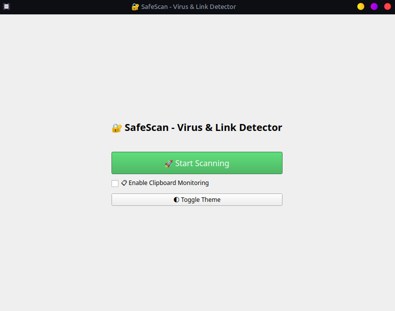
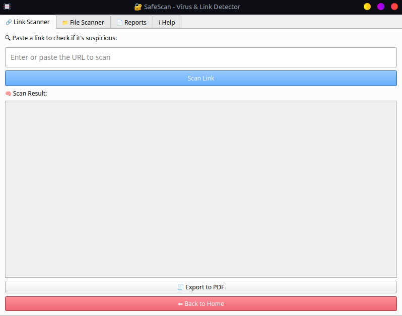

# 🛡️ SafeScan

**SafeScan** is a powerful and user-friendly desktop application designed to scan files and URLs for malicious or suspicious content. With a clean graphical interface built using PyQt5, SafeScan offers a smooth experience for keeping your system safe from harmful threats.


---

## 🚀 Features

- 🔗 **URL Scanner**: Check whether a website or link is safe before you open it.
- 📂 **File Scanner**: Scan local files for malicious or suspicious content.
- ⚠️ **Real-time Alerts**: Get instant alerts when harmful content is detected.
- 📝 **Scan History**: All scan results are logged in `report_log.txt` for future reference.
- 🖥️ **Modern GUI**: Easy-to-use, responsive graphical interface built with PyQt5.

---

## 🧱 Project Structure

```
safescan/
│
├── main.py              # Application entry point
├── file_scanner.py      # File scanning logic
├── link_scanner.py      # URL scanning logic
├── utils.py             # Helper functions
├── report_log.txt       # Stores scan history
├── assets/
│   └── icon.png         # App icon
├── screenshots/
│   ├── home.png         # Screenshot: Home screen
│   └── scan_result.png  # Screenshot: Scan screen
└── __pycache__/         # Python cache files (auto-generated)
```

---

## 📦 Requirements

Python 3.7 or higher is recommended.

Install dependencies by running:

```
pip install -r requirements.txt
```

**requirements.txt:**
```
PyQt5
requests
```

---

## ▶️ How to Run the App

```bash
cd safescan
python main.py
```

---

## 📸 Screenshots

Below are a few glimpses of the SafeScan GUI in action.

### 🖼️ Home Screen


### 🖼️ Scan Result


> You can replace these images by placing your own screenshots in the `screenshots/` folder and naming them accordingly.

---

## 📄 License

This project is free to use for personal and educational purposes.

---

**Developed ❤️ by [Sunil Jat]**
